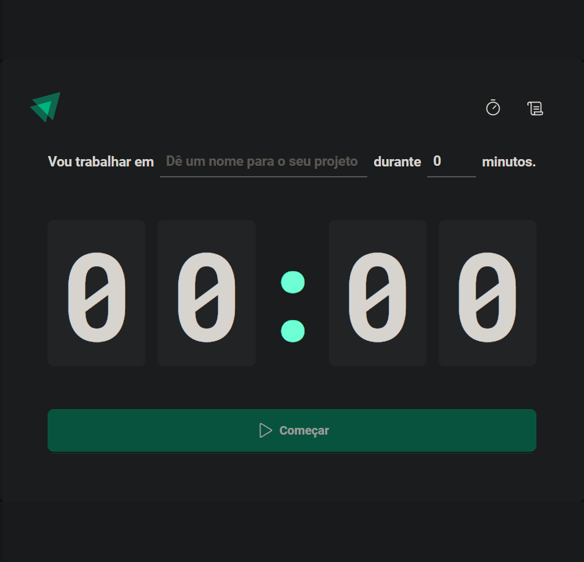
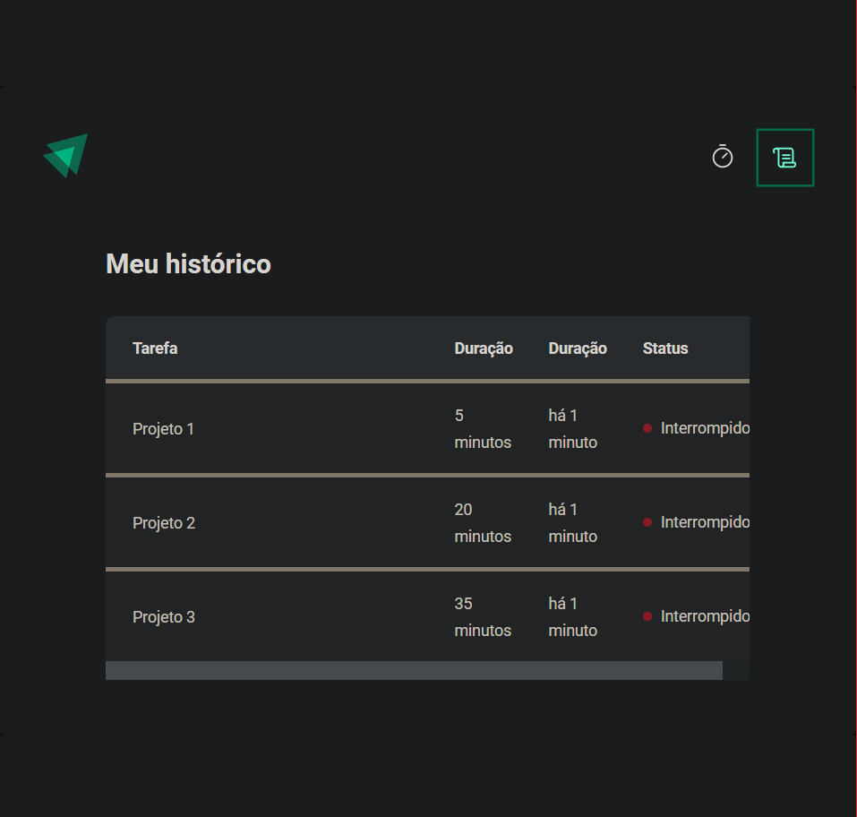

# ignite-timer

## O que aprendi no projeto
* Styled Components
* ESLInt
* React Router DOM
* Controlled vs Uncontrolled
* React Hook Form 
* useEffect
* Action Types
* Immer
 

Faça um clone do projeto 
use "npm install"
depois "npm run dev" para visualizar o projeto

